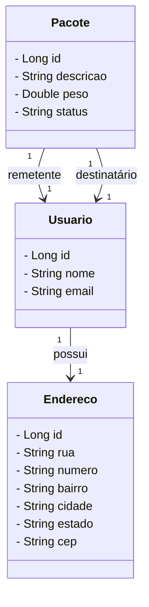

### Correio API
Esta é uma API RESTful para gerenciamento de usuários, endereços e pacotes em um sistema de correios. A aplicação é construída usando Spring Boot, Spring Security, JWT para autenticação, e documentada com OpenAPI 3 e Swagger.

#### Funcionalidades
* Gerenciamento de Usuários:

1. Registrar um novo usuário.
2. Listar todos os usuários.
3. Obter detalhes de um usuário específico.
4. Atualizar informações de um usuário.
5. Excluir um usuário.

#### Gerenciamento de Endereços:

1. Criar um novo endereço.
2. Listar todos os endereços.
3. Obter detalhes de um endereço específico.
4. Atualizar informações de um endereço.
5. Excluir um endereço.

#### Gerenciamento de Pacotes:

Registrar um novo pacote.
Listar todos os pacotes.
Obter detalhes de um pacote específico.
Atualizar informações de um pacote.
Excluir um pacote.

### Diagrama UML

